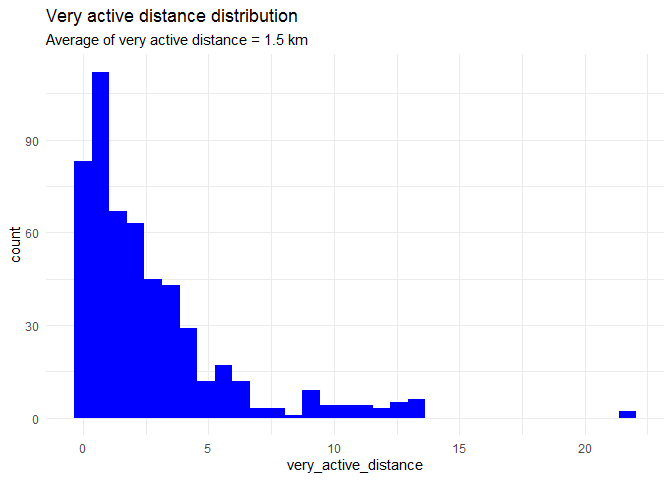

Bellabeat Data Analysis Cases Study
================

by: Yannadatch Ouchalern, Last Updated: July 14th, 2021

<!-- -->

## Table of Contents.

  - Purpose Statement (What are we talking about ?)
  - Prepare & Process Data
  - Analyze & Visualization
  - Conclusion
  - Recommendation
  - Appendix

## What are we talking about ?

### Introduction

This is Bellabeat data analysis case study, that will perform many
real-world task of data analyst. Bellabeat, a high-tech manufacturer of
health-focused **product for woman.** Bellabeat is successful small
company. but they have potential to become a larger player in the global
**smart device** market.

Bellabeat have application provide users with health data related to
their activity, sleep, stress, menstrual cycle, and mindfulness habits.
this data can help user to better know current habit and make healthy
decisions. The Bellabeat app connects to their line of **smart wellness
product** such as

  - **Leaf**: Bellabeat’s classic wellness tracker can be worn as a
    bracket, necklace, or clip. The Leaf track activity, sleep, and
    stress
  - **Time**: This wellness watch combines the timeless look of a
    classic timepiece with smart technology to track user activity,
    sleep, and stress.
  - **Sping** This is a water bottle that tracks daily water intake
    using smart technology to ensure that you are appropriately hydrated
    throughout the day.
  - **Bellabeat membership**: Bellabeat also offers a subscription-based
    membership program for users. Membership gives users 24/7 access to
    fully personalized guidance on nutrition, activity, sleep, health
    and beauty, and mindfulness based on their lifestyle and goals.

This report will focus on Bellabeat’s product and **analyze smart device
data** to help guide and high-level recommendation for **Bellabeat’s
marketing strategy.**

### Objective

Analyze smart device data to guide and recommend marketing strategy

## Prepare & Process Data

### import library

``` r
#import library:
library(tidyverse)
library(ggplot2)
library(sqldf)
library(janitor) #for clean_names()
library(lubridate)
library(dplyr)
library(ggcorrplot)
library(here)
theme_set(theme_minimal())
```

### import dataset

``` r
#import dataset: 
daily_activity <- read.csv("dailyActivity_merged.csv")
daily_sleep <- read.csv("sleepDay_merged.csv")
heartrate_seconds <- read.csv("heartrate_seconds_merged.csv")
```

``` r
#view original dataset
glimpse(daily_activity)
```

    ## Rows: 940
    ## Columns: 15
    ## $ Id                       <dbl> 1503960366, 1503960366, 1503960366, 150396...
    ## $ ActivityDate             <chr> "4/12/2016", "4/13/2016", "4/14/2016", "4/...
    ## $ TotalSteps               <int> 13162, 10735, 10460, 9762, 12669, 9705, 13...
    ## $ TotalDistance            <dbl> 8.50, 6.97, 6.74, 6.28, 8.16, 6.48, 8.59, ...
    ## $ TrackerDistance          <dbl> 8.50, 6.97, 6.74, 6.28, 8.16, 6.48, 8.59, ...
    ## $ LoggedActivitiesDistance <dbl> 0, 0, 0, 0, 0, 0, 0, 0, 0, 0, 0, 0, 0, 0, ...
    ## $ VeryActiveDistance       <dbl> 1.88, 1.57, 2.44, 2.14, 2.71, 3.19, 3.25, ...
    ## $ ModeratelyActiveDistance <dbl> 0.55, 0.69, 0.40, 1.26, 0.41, 0.78, 0.64, ...
    ## $ LightActiveDistance      <dbl> 6.06, 4.71, 3.91, 2.83, 5.04, 2.51, 4.71, ...
    ## $ SedentaryActiveDistance  <dbl> 0, 0, 0, 0, 0, 0, 0, 0, 0, 0, 0, 0, 0, 0, ...
    ## $ VeryActiveMinutes        <int> 25, 21, 30, 29, 36, 38, 42, 50, 28, 19, 66...
    ## $ FairlyActiveMinutes      <int> 13, 19, 11, 34, 10, 20, 16, 31, 12, 8, 27,...
    ## $ LightlyActiveMinutes     <int> 328, 217, 181, 209, 221, 164, 233, 264, 20...
    ## $ SedentaryMinutes         <int> 728, 776, 1218, 726, 773, 539, 1149, 775, ...
    ## $ Calories                 <int> 1985, 1797, 1776, 1745, 1863, 1728, 1921, ...

``` r
glimpse(daily_sleep)
```

    ## Rows: 413
    ## Columns: 5
    ## $ Id                 <dbl> 1503960366, 1503960366, 1503960366, 1503960366, ...
    ## $ SleepDay           <chr> "4/12/2016 12:00:00 AM", "4/13/2016 12:00:00 AM"...
    ## $ TotalSleepRecords  <int> 1, 2, 1, 2, 1, 1, 1, 1, 1, 1, 1, 1, 1, 1, 1, 1, ...
    ## $ TotalMinutesAsleep <int> 327, 384, 412, 340, 700, 304, 360, 325, 361, 430...
    ## $ TotalTimeInBed     <int> 346, 407, 442, 367, 712, 320, 377, 364, 384, 449...

``` r
glimpse(heartrate_seconds)
```

    ## Rows: 2,483,658
    ## Columns: 3
    ## $ Id    <dbl> 2022484408, 2022484408, 2022484408, 2022484408, 2022484408, 2...
    ## $ Time  <chr> "4/12/2016 7:21:00 AM", "4/12/2016 7:21:05 AM", "4/12/2016 7:...
    ## $ Value <int> 97, 102, 105, 103, 101, 95, 91, 93, 94, 93, 92, 89, 83, 61, 6...

### Data cleaning

``` r
#clean columns name : make sure that columns names are unique
daily_activity <- clean_names(daily_activity)
daily_sleep <- clean_names(daily_sleep)
heartrate_seconds <- clean_names(heartrate_seconds)

#view dataset
glimpse(daily_activity)
```

    ## Rows: 940
    ## Columns: 15
    ## $ id                         <dbl> 1503960366, 1503960366, 1503960366, 1503...
    ## $ activity_date              <chr> "4/12/2016", "4/13/2016", "4/14/2016", "...
    ## $ total_steps                <int> 13162, 10735, 10460, 9762, 12669, 9705, ...
    ## $ total_distance             <dbl> 8.50, 6.97, 6.74, 6.28, 8.16, 6.48, 8.59...
    ## $ tracker_distance           <dbl> 8.50, 6.97, 6.74, 6.28, 8.16, 6.48, 8.59...
    ## $ logged_activities_distance <dbl> 0, 0, 0, 0, 0, 0, 0, 0, 0, 0, 0, 0, 0, 0...
    ## $ very_active_distance       <dbl> 1.88, 1.57, 2.44, 2.14, 2.71, 3.19, 3.25...
    ## $ moderately_active_distance <dbl> 0.55, 0.69, 0.40, 1.26, 0.41, 0.78, 0.64...
    ## $ light_active_distance      <dbl> 6.06, 4.71, 3.91, 2.83, 5.04, 2.51, 4.71...
    ## $ sedentary_active_distance  <dbl> 0, 0, 0, 0, 0, 0, 0, 0, 0, 0, 0, 0, 0, 0...
    ## $ very_active_minutes        <int> 25, 21, 30, 29, 36, 38, 42, 50, 28, 19, ...
    ## $ fairly_active_minutes      <int> 13, 19, 11, 34, 10, 20, 16, 31, 12, 8, 2...
    ## $ lightly_active_minutes     <int> 328, 217, 181, 209, 221, 164, 233, 264, ...
    ## $ sedentary_minutes          <int> 728, 776, 1218, 726, 773, 539, 1149, 775...
    ## $ calories                   <int> 1985, 1797, 1776, 1745, 1863, 1728, 1921...

``` r
glimpse(daily_sleep)
```

    ## Rows: 413
    ## Columns: 5
    ## $ id                   <dbl> 1503960366, 1503960366, 1503960366, 1503960366...
    ## $ sleep_day            <chr> "4/12/2016 12:00:00 AM", "4/13/2016 12:00:00 A...
    ## $ total_sleep_records  <int> 1, 2, 1, 2, 1, 1, 1, 1, 1, 1, 1, 1, 1, 1, 1, 1...
    ## $ total_minutes_asleep <int> 327, 384, 412, 340, 700, 304, 360, 325, 361, 4...
    ## $ total_time_in_bed    <int> 346, 407, 442, 367, 712, 320, 377, 364, 384, 4...

``` r
glimpse(heartrate_seconds)
```

    ## Rows: 2,483,658
    ## Columns: 3
    ## $ id    <dbl> 2022484408, 2022484408, 2022484408, 2022484408, 2022484408, 2...
    ## $ time  <chr> "4/12/2016 7:21:00 AM", "4/12/2016 7:21:05 AM", "4/12/2016 7:...
    ## $ value <int> 97, 102, 105, 103, 101, 95, 91, 93, 94, 93, 92, 89, 83, 61, 6...

``` r
# Inspecting the distinct Id's in each of the three dataframes:
print(n_distinct(daily_activity$id))
```

    ## [1] 33

``` r
print(n_distinct(daily_sleep$id))
```

    ## [1] 24

``` r
print(n_distinct(heartrate_seconds$id))
```

    ## [1] 14

### Transform data

``` r
#Define Foreign Key to join table
daily_activity_v2 <- daily_activity %>% 
                     mutate(activity_date = mdy(activity_date)) %>% 
                     unite(id_date,c("id", "activity_date"), sep = '_')

daily_sleep_v2 <- daily_sleep %>%
                  mutate(sleep_day = substr(sleep_day,1,9)) %>%  
                  mutate(sleep_day = mdy(sleep_day)) %>% 
                  unite(id_date, c("id", "sleep_day"))

heartrate_seconds_v2 <- heartrate_seconds %>%
                        mutate(date = substr(time, 1,9)) %>% 
                        mutate(date = mdy(date)) %>% 
                        unite(id_date, c('id', 'date'))

#glimpse(daily_activity_v2)
#glimpse(daily_sleep_v2)
#glimpse(heartrate_seconds_v2)
```

``` r
# Inspecting the distinct Id's in each of the three dataframes:
print(n_distinct(daily_activity_v2$id_date))
```

    ## [1] 940

``` r
print(n_distinct(daily_sleep_v2$id_date))
```

    ## [1] 410

``` r
print(n_distinct(heartrate_seconds_v2$id_date))
```

    ## [1] 334

``` r
#transform table "daily_activity_v2" by add a new column "total_active_minutes".Which is the sum of columns 
#"very_active_minutes", "fairly_active_minutes", "lightly_active_minutes" then 
# add "total_active_hours" which is divide of "total_active_minutes"by 60, and select columns as used for the next process:

daily_activity_v3 <- daily_activity_v2 %>% 
                     group_by(id_date) %>% 
                     mutate(total_active_minutes = sum(c(very_active_minutes,
                                                         fairly_active_minutes,
                                                         lightly_active_minutes))) %>% 
                     mutate(total_active_hours = round(total_active_minutes/60,2)) %>% 
                     select(-c(4:13,15))

#glimpse(daily_activity_v2)
#glimpse(daily_activity_v3)
```

``` r
#transform table "daily_sleep_v2" by add "total_hours_asleep" which is divide of "total_minutes_asleep" by 60 and
#select columns as used for the next process:
daily_sleep_v3 <- daily_sleep_v2 %>% 
                  mutate(total_hours_asleep = round(total_minutes_asleep/60,2)) %>% 
                  select(c('id_date', 'total_hours_asleep'))

#glimpse(daily_sleep_v2)                
#glimpse(daily_sleep_v3)
```

``` r
#transform table "heartrate_seconds_v2" by summaries Max(), Min(), Mean() of Heart rate per day 
heartrate_seconds_v3 <- heartrate_seconds_v2 %>% 
                       group_by(id_date) %>% 
                       summarise(max_hr_per_day = max(value), 
                                 min_hr_per_day = min(value),
                                 avg_hr_per_day = round(mean(value),3))
```

    ## `summarise()` ungrouping output (override with `.groups` argument)

``` r
#glimpse(heartrate_seconds_v2)                                 
#glimpse(heartrate_seconds_v3)
```

``` r
# Inspecting the distinct Id's in each of the three dataframes:
print(n_distinct(daily_activity_v3$id_date))
```

    ## [1] 940

``` r
print(n_distinct(daily_sleep_v3$id_date))
```

    ## [1] 410

``` r
print(n_distinct(heartrate_seconds_v3$id_date))
```

    ## [1] 334

``` r
#Combine table
combine_df = merge(daily_activity_v3, daily_sleep_v3, by = 'id_date')
combine_df = merge(combine_df, heartrate_seconds_v3, by = 'id_date')
glimpse(combine_df)
```

    ## Rows: 182
    ## Columns: 9
    ## $ id_date            <chr> "2026352035_2016-04-17", "2026352035_2016-04-25"...
    ## $ total_steps        <int> 838, 6017, 7018, 10685, 10352, 10129, 10465, 547...
    ## $ total_distance     <dbl> 0.52, 3.73, 4.35, 6.62, 7.01, 6.70, 6.92, 3.62, ...
    ## $ calories           <int> 1214, 1576, 1690, 1869, 2038, 2010, 2133, 1882, ...
    ## $ total_active_hours <dbl> 1.00, 4.33, 5.92, 6.68, 4.10, 4.25, 5.15, 4.28, ...
    ## $ total_hours_asleep <dbl> 7.28, 8.43, 8.52, 8.85, 7.78, 7.42, 7.53, 9.27, ...
    ## $ max_hr_per_day     <int> 80, 125, 122, 123, 158, 154, 136, 134, 134, 195,...
    ## $ min_hr_per_day     <int> 63, 70, 70, 70, 55, 52, 55, 55, 53, 53, 51, 53, ...
    ## $ avg_hr_per_day     <dbl> 68.656, 99.506, 84.135, 98.234, 73.813, 72.579, ...

``` r
#Inspecting the distinct Id's
#print(n_distinct(combine_df$id_date))
```

## Analyze & Visualization

## Variable Correlation

``` r
# Computing a correlation matrix for the numeric variables of the dataframe "combine_df"
cor_df <- combine_df %>% select(-id_date)
cor_matrix <- round(cor(cor_df), 1)

head(cor_matrix)
```

    ##                    total_steps total_distance calories total_active_hours
    ## total_steps                1.0            1.0      0.5                0.8
    ## total_distance             1.0            1.0      0.6                0.8
    ## calories                   0.5            0.6      1.0                0.5
    ## total_active_hours         0.8            0.8      0.5                1.0
    ## total_hours_asleep        -0.1           -0.1     -0.1                0.0
    ## max_hr_per_day             0.5            0.5      0.4                0.4
    ##                    total_hours_asleep max_hr_per_day min_hr_per_day
    ## total_steps                      -0.1            0.5           -0.1
    ## total_distance                   -0.1            0.5           -0.2
    ## calories                         -0.1            0.4           -0.6
    ## total_active_hours                0.0            0.4            0.0
    ## total_hours_asleep                1.0           -0.2           -0.1
    ## max_hr_per_day                   -0.2            1.0           -0.2
    ##                    avg_hr_per_day
    ## total_steps                   0.2
    ## total_distance                0.1
    ## calories                      0.0
    ## total_active_hours            0.4
    ## total_hours_asleep           -0.3
    ## max_hr_per_day                0.3

``` r
# Visualize the correlation matrix
ggcorrplot(cor_matrix, hc.order = TRUE, type = "lower", lab = TRUE) +
          labs(title = 'Correlation matrix', 
          subtitle = "pearson correlation values")
```

<!-- -->

#### Interpretation

  - `1` = a strong positive correlation `0` = no correlation `-1` =
    strong negative correlation

  - `Total Active Hours` **strong positive correlation** with `Total
    steps and Total distance`

  - `Calories` **positive correlation** with
    
      - `Total distance` = 0.6
      - `Total active hours` = 0.5
      - `Total steps` = 0.5

  - `Calories` **negative correlation** with `min Heart rate per day`

## Calories

``` r
#glimpse(combine_df)
```

``` r
# Correlation plot between `Calories burned` and `Total distance` in a day 
ggplot(data = combine_df) +
  geom_point(mapping = aes(x = total_distance, y = calories), color = 'blue') + 
  labs(title = 'Correlation Coefficient = 0.6',
       subtitle = 'Correlation plot between Calories vs. Total_distance') + 
  geom_smooth(mapping = aes(x = total_distance, y = calories))
```

    ## `geom_smooth()` using method = 'loess' and formula 'y ~ x'

<!-- -->

``` r
# Correlation plot between `Calories burned` and `Total active hours` in a day
ggplot(data = combine_df) +
  geom_point(mapping = aes(x = total_active_hours, y = calories), color = 'blue') +
  labs(title = 'Correlation Coefficient = 0.5', 
       subtitle = 'Correlation plot between Calories vs. Total_active_hours') +
  geom_smooth(mapping = aes(x = total_active_hours, y = calories))
```

    ## `geom_smooth()` using method = 'loess' and formula 'y ~ x'

<!-- -->

``` r
# Correlation plot between `Calories burned` and `Total steps` in a day
ggplot(data = combine_df) +
  geom_point(mapping = aes(x = total_steps, y = calories), color = 'blue') +
  labs(title = 'Correlation Coefficient = 0.5',
       subtitle = 'Correlation plot between Calories vs. Total steps') +
  geom_smooth(mapping = aes(x = total_steps, y = calories))
```

    ## `geom_smooth()` using method = 'loess' and formula 'y ~ x'

<!-- -->

``` r
# Correlation plot between `Calories burned` and `min_hr_per_day` in a day
ggplot(data = combine_df) +
  geom_point(mapping = aes(x = min_hr_per_day, y = calories), color = 'blue') +
  labs(title = 'Correlation Coefficient = - 0.6',
       subtitle = 'Correlation plot between Calories vs.min Heart rate per day') +
  geom_smooth(mapping = aes(x = min_hr_per_day, y = calories))
```

    ## `geom_smooth()` using method = 'loess' and formula 'y ~ x'

<!-- -->

### Interpretation

  - `min Heart rate per day` **no significant correlation** with
    `Calories`
  - `Total distance` **strong positive correlation** with `Calories`
  - **Longer distance** have **Higher calories burned**

## Distance

``` r
#glimpse(daily_activity_v2)
```

``` r
# Computing a correlation matrix for the numeric variables of the dataframe "combine_df"
distance_df <- daily_activity_v2 %>% select(-c(2,4:5,9:14))
distance_cor_df <- distance_df %>% select(-c(1))
#glimpse(distance_df)
#glimpse(distance_cor_df)                                            

distance_cor_matrix <- round(cor(distance_cor_df), 1)
head(distance_cor_matrix)
```

    ##                            total_distance very_active_distance
    ## total_distance                        1.0                  0.8
    ## very_active_distance                  0.8                  1.0
    ## moderately_active_distance            0.5                  0.2
    ## light_active_distance                 0.7                  0.2
    ##                            moderately_active_distance light_active_distance
    ## total_distance                                    0.5                   0.7
    ## very_active_distance                              0.2                   0.2
    ## moderately_active_distance                        1.0                   0.2
    ## light_active_distance                             0.2                   1.0

``` r
# Visualize the correlation matrix
ggcorrplot(distance_cor_matrix, hc.order = TRUE, type = "lower", lab = TRUE) +
          labs(title = 'Correlation matrix', 
          subtitle = "pearson correlation values")
```

<!-- -->

### Interpretation

  - `1` = a strong positive correlation `0` = no correlation `-1` =
    strong negative correlation

  - `Total_distance` **positive correlation** with
    
      - `Very_active_distance` = 0.8
      - `Light_active_distance` = 0.7

## Very active distance & Light active distance

``` r
#glimpse(distance_df)
```

``` r
# Correlation plot between `Distance` and `Very_active_distance` in a day 
ggplot(data = distance_df) +
  geom_point(mapping = aes(x = very_active_distance, y = total_distance), color = 'blue') + 
  labs(title = 'Correlation Coefficient = 0.8',
       subtitle = 'Correlation plot between Distance vs.Very_active_distance') + 
  geom_smooth(mapping = aes(x = very_active_distance, y = total_distance))
```

    ## `geom_smooth()` using method = 'loess' and formula 'y ~ x'

<!-- -->

``` r
# Correlation plot between `Distance` and `Light_active_distance` in a day 
ggplot(data = distance_df) +
  geom_point(mapping = aes(x = light_active_distance, y = total_distance), color = 'blue') + 
  labs(title = 'Correlation Coefficient = 0.7',
       subtitle = 'Correlation plot between Distance vs.Light_active_distance') + 
  geom_smooth(mapping = aes(x = light_active_distance, y = total_distance))
```

    ## `geom_smooth()` using method = 'loess' and formula 'y ~ x'

<!-- -->

## Interpretation

  - `Very active distance` **strong positive correlation** with `Total
    distance`
  - **Longer very active distance** have **Longer total distance**  
  - As Longer total Distance have High Calories burned
  - So, **Longer Very active distance** have strong significant
    correlate with **High Calories burned**.

## Very active distance distribution

``` r
summary(distance_df)
```

    ##    id_date          total_distance   very_active_distance
    ##  Length:940         Min.   : 0.000   Min.   : 0.000      
    ##  Class :character   1st Qu.: 2.620   1st Qu.: 0.000      
    ##  Mode  :character   Median : 5.245   Median : 0.210      
    ##                     Mean   : 5.490   Mean   : 1.503      
    ##                     3rd Qu.: 7.713   3rd Qu.: 2.053      
    ##                     Max.   :28.030   Max.   :21.920      
    ##  moderately_active_distance light_active_distance
    ##  Min.   :0.0000             Min.   : 0.000       
    ##  1st Qu.:0.0000             1st Qu.: 1.945       
    ##  Median :0.2400             Median : 3.365       
    ##  Mean   :0.5675             Mean   : 3.341       
    ##  3rd Qu.:0.8000             3rd Qu.: 4.782       
    ##  Max.   :6.4800             Max.   :10.710

``` r
#visualization Very active distance distribution
distance_df %>% 
  filter(very_active_distance> 0) %>% 
  ggplot() + 
  geom_histogram(mapping = aes(x = very_active_distance), binwidth = 0.7, fill = 'blue') +
  labs(title = 'Very active distance distribution', 
       subtitle = 'Average of very active distance = 1.5 km')
```

<!-- -->

## Conclusion

  - **Longer Very active distance** have strong significant correlate
    with **High Calories burned**
  - `Average of very active distance` = 1.5 km

## Recommendation

  - Apply insights finding with product **Bellabeat membership** to plan
    program for customers who is on the diet and need highly Calories
    burned.
  - Apply insights finding with manufacturing line of **smart wellness
    product** such as `Watch` and `the Leaf product` to engineering
    design for running women

## Appendix

### Dataset

  - FitBit Fitness Tracker Data (CC0: Public Domain, dataset made
    available through Mobius) from Kaggle dataset
    <https://www.kaggle.com/arashnic/fitbit>  
  - Table used for analyze
      - dailyActivity\_merged
      - sleepDay\_merged
      - heartrate\_seconds\_merged

# Thanks you
